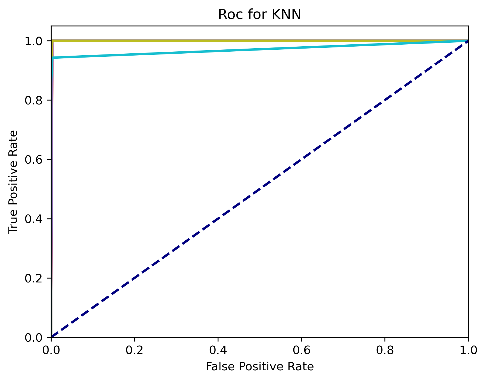
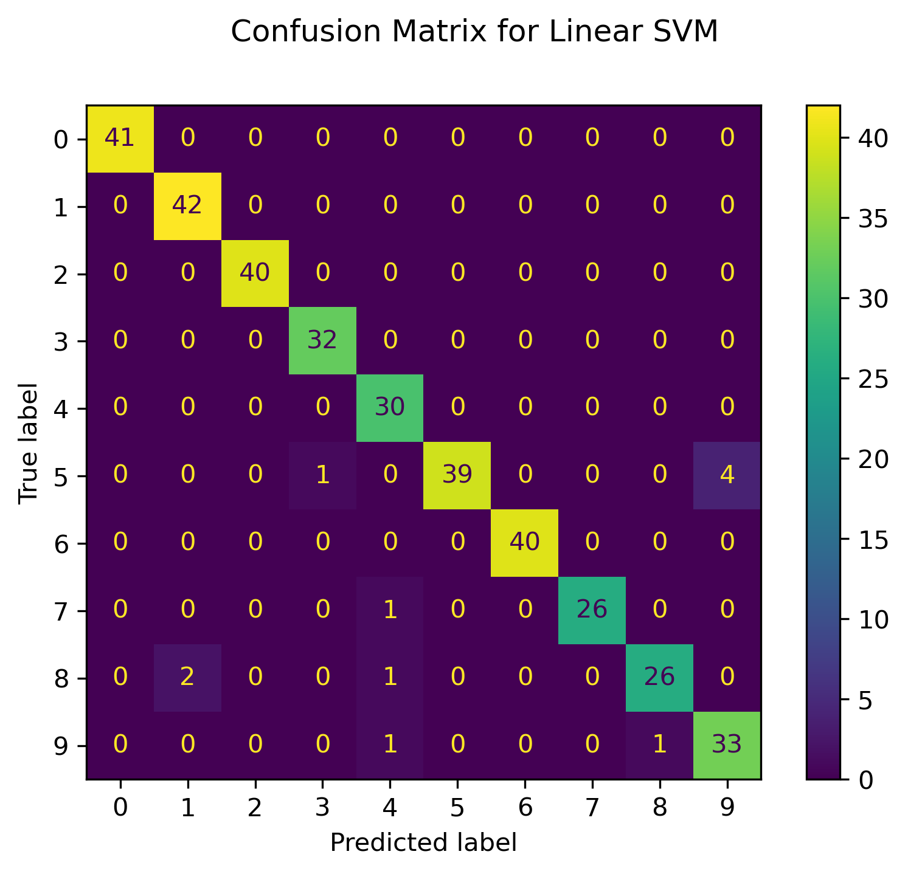
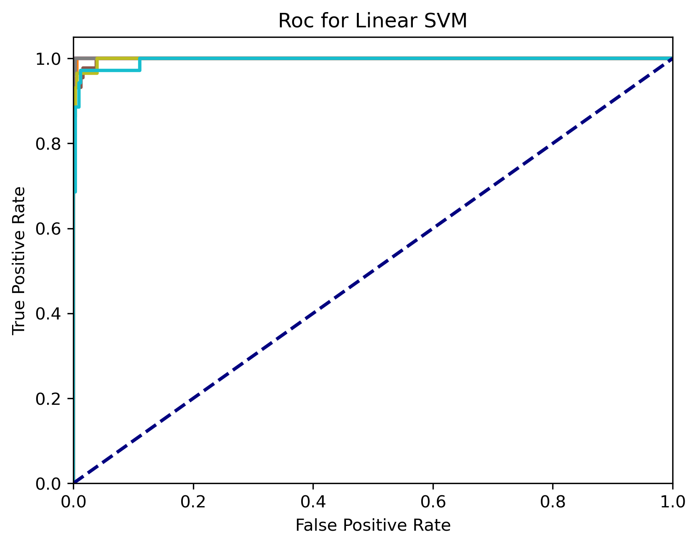
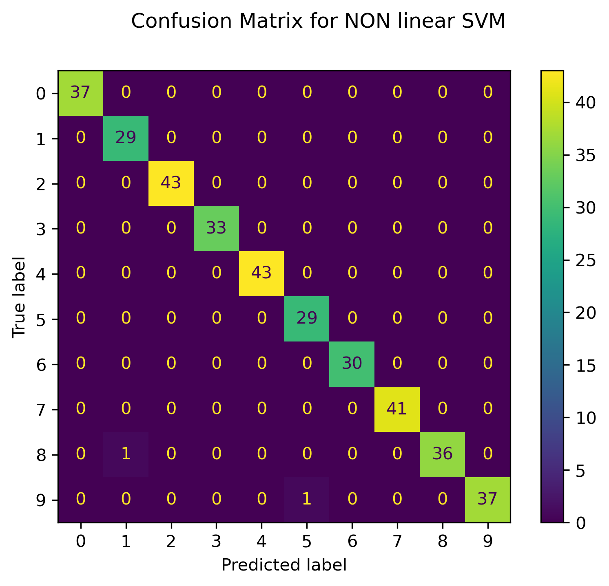
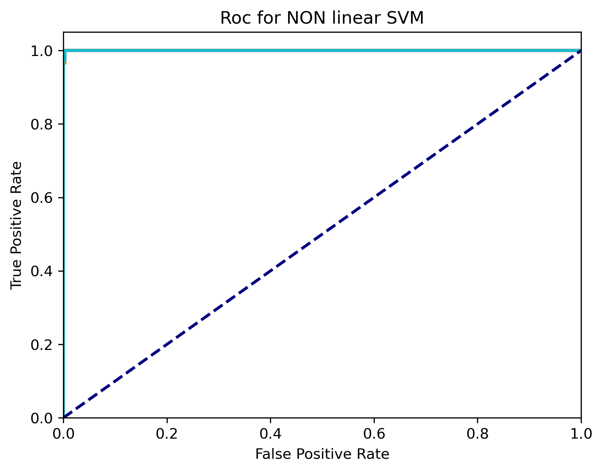
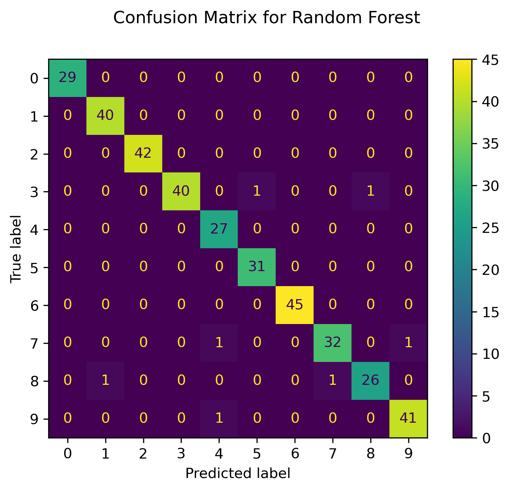
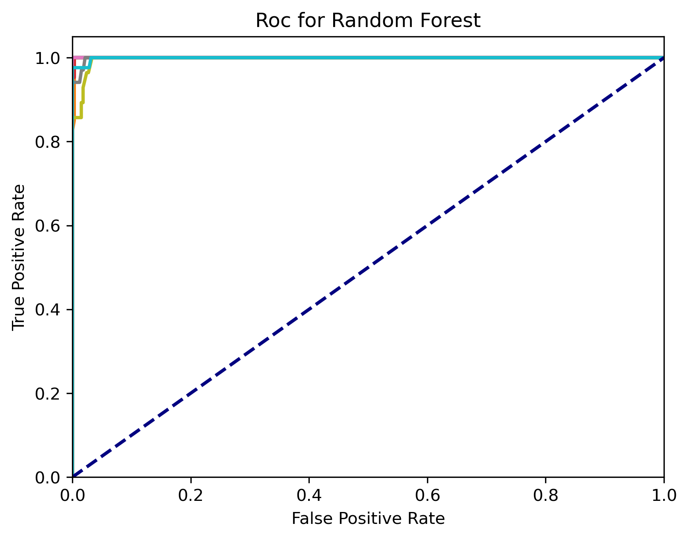

# computational-modeling-samples

**Using sklearn**

- KNN
- Linear SVM
- Non Linear SVM
- Rando forest

### command-line
options : 

| model | arg |
| ------------- | ------------- |
| random forest  | (test_size= 0.2, random_state=None) | 
| linear svm | (test_size= 0.2, random_state=None) |
| non linear svm | (test_size= 0.2, random_state=None) |
| knn | (knn, test_size= 0.2, random_state=None) |


  arg : specifies parameters of models based on top and in order
  
  plot : confusion matrix    or   roc
  
  dir : if dir is set, image of plots and a report will be created
  
  report : reports in command lin
            
                


Samples : 

```
python3 main.py model="random forest" plot="confusion matrix" plot="roc" dir="test/randomForest/" report="True" 
```

```
python3 main.py model="linear svm" plot="confusion matrix" plot="roc" dir="test/linearSVM/" report="True"
```

```
python3 main.py model="non linear svm" plot="confusion matrix" plot="roc" dir="test/nonLinearSVM/" report="True"
```

```
python3 main.py model="knn" arg="2" plot="confusion matrix" plot="roc" dir="test/knn2/" report="True"
```

```
python3 main.py model="knn" arg="10" plot="confusion matrix" plot="roc" dir="test/knn10/" report="True"
```

### python-code
```
AllModels().reportData().randomForest(20).report().plot('confusion matrix',True).plot('roc')
AllModels().reportData().knn(2).report().report().plot('confusion matrix').plot('roc')
AllModels().reportData().linearSVM().report().report().plot('confusion matrix').plot('roc')
AllModels().reportData().nonLinearSVM().report().report().plot('confusion matrix').plot('roc')
```

### Results

#### KNN2



----

#### Linear SVM



----

#### Non Linear SVM



----


#### Random Forest



----